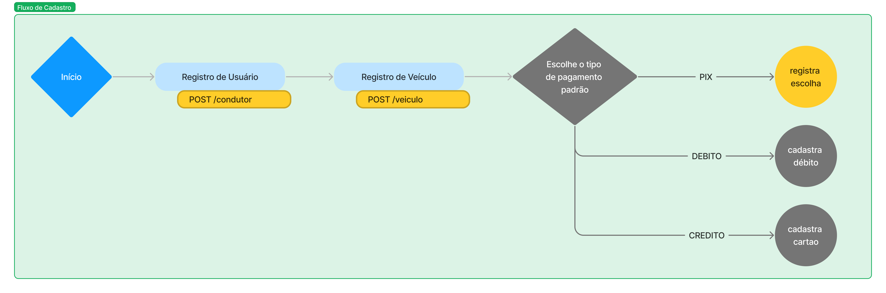
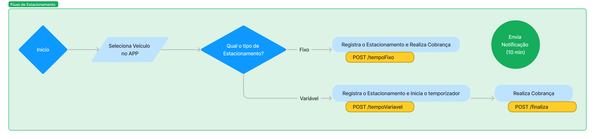
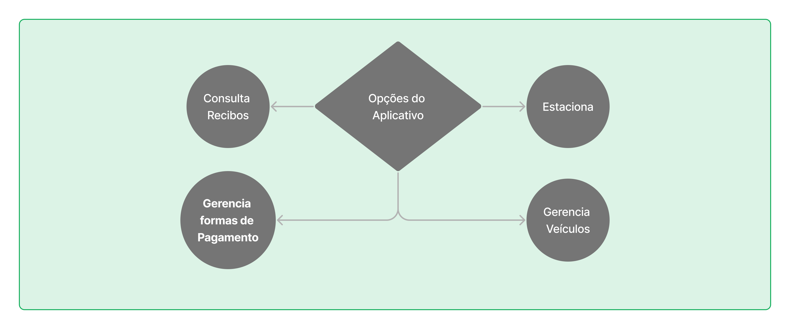
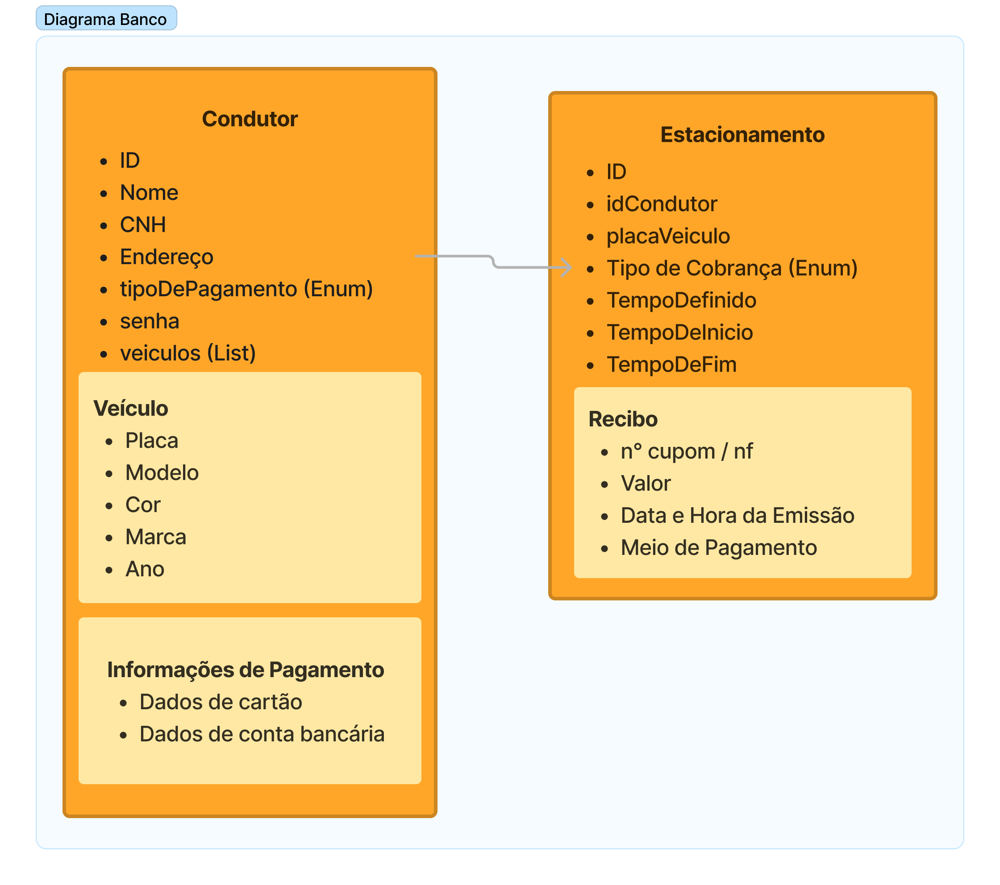

# ParkAssist

ParkAssist é um sistema de parquímetro digital para gerenciamento e cobrança de vagas de estacionamento rotativo. Tem por princípios fundamentais a utilização de tecnologias modernas e escaláveis para prover uma solução otimizada e eficiente, capaz de responder à variações de demanda diárias ou sazonais.

## Objetivos

O principal objetivo deste relatório é dissertar sobre o desenvolvimento e implementação do projeto.

Como objetivos específicos temos:

- Apresentar a estrutura e arquitetura;

- Discursar sobre a escalabilidade do sistema de acordo com a demanda;

- Discutir sobre escolhas realizadas e desafios encontrados.

## Desenvolvimento

### Tecnologias e Ferramentas

Definimos como base do projeto a utilização da *stack* Java 17, Quarkus e o banco de dados MongoDB aliado à interface Panache. A versão 17 do Java é a mais recente de suporte de longo termo. O Quarkus é uma *framework* leve, performático e focado em escalabilidade por orquestração de contêineres e Kubernetes . A escolha pelo MongoDB se deu por ser um banco de dados não relacional, no qual a estrutura desnormalizada seria benéfica para a realização de buscas pontuais baseadas nos *tickets* de estacionamento dos usuários.

O Maven é a ferramenta escolhida para gerenciamento de dependências enquanto o Git e Github são utilizados para versionamento e colaboração entre os membros do time. A ferramenta Github Actions foi configurada para implementar o fluxo de CI/CD. Uma vez que os membros do grupo trabalham com suas IDEs de preferência, seja IntelliJ, Eclipse ou VS Code, foi implementado o arquivo `.gitignore` para não permitir o compartilhamento de configurações desses editores ao repositório do projeto.

Para garantir a consistência do ambiente de desenvolvimento e execução da aplicação utilizamos o Docker, cujas imagens geradas são utilizadas pelo Kubernetes para prover a escalabilidade da aplicação em relação à demanda.

Por fim, para gerenciar nossa biblioteca de requisições, realização de testes e documentação da API, utilizamos o aplicativo Postman.

### Aplicação

Nesta fase, realizamos uma análise baseada nos requisitos funcionais de como seria o comportamento do aplicativo ParkAssist para definirmos os métodos e requisições necessários no *backend* da aplicação. Assim, identificamos dois fluxos principais: cadastro e estacionamento.

O primeiro fluxo é definido pela configuração inicial, logo após a primeira inicialização, o qual é ilustrado na Figura 1. Este consiste do cadastro dos dados de identificação do condutor, de seus veículos e também da opção de pagamento preferencial.

Figura 1: Fluxo de Cadastro

Fonte: Produção dos autores, 2023.

 

Por sua vez, o fluxo de estacionamento representa a utilização cotidiana do sistema, representado pela Figura 2. Neste, o condutor ao estacionar escolhe no aplicativo o veículo que está dirigindo e seleciona um método de cobrança: tempo fixo ou tempo variável. No primeiro, o usuário define a quantidade de horas que necessita de estacionamento e realiza o pagamento, quando o tempo estiver finalizando notificações são enviadas. Já no segundo método, um cronômetro é iniciado e o pagamento é realizado quando o condutor indica o fim do estacionamento no aplicativo, esta modalidade está disponível apenas para a forma de pagamento cartão de crédito.

Figura 2: Fluxo de Estacionamento

Fonte: Produção dos autores, 2023.

 

Vale ressaltar que as opções de gerenciamento dos veículos e das opções de pagamento também devem estar disponíveis de forma avulsa para edição a qualquer tempo pelo usuário. Assim, como mostrado na Figura 3, o usuário possuíra as seguintes opções na tela inicial do aplicativo (após o cadastro), que além de opções de edição dos cadastros e de início de estacionamento, também pode visualizar os recibos anteriores.

Figura 3: Opções presentes no aplicativo

Fonte: Produção dos autores, 2023.

 

## Banco de Dados

Como banco de dados optamos por utilizar o MongoDB e o estruturamos em torno de dois documentos principais: Condutor e Estacionamento. O primeiro armazena os dados de identificação do usuário, informações sobre seus veículos (por exemplo placa e modelo, que podem ser utilizados para conferência por fiscais) e opção padrão de pagamento. No documento relativo ao Estacionamento guardamos o tipo de cobrança, horário de inicio e o recibo (após executado o pagamento).

<TODO Falar sobre caracteristicas de performance do banco>

Figura 4: Estrutura do Banco de Dados

Fonte: Produção dos autores, 2023.

 

Para fazer as buscas no banco de dados estamos utilizando a extensão Panache disponível no Quarkus, que simplifica o uso do MongoDB junto ao Hibernate. Fazemos as buscas através de métodos oferecidos pelo referido *framework*, como por exemplo o `listAll`, que retorna uma lista de todos os registros, ou `findById` que retorna um registro específico.

## Arquitetura

Adotamos a arquitetura em camadas, nas quais, dividimos o projeto em pacotes a saber, controladora, serviço e domínio. Estão presentes também, os padrões de Domain Driven Design (DDD) e Representational State Transfer (REST), promovendo uma estrutura eficiente e clara. Também, abordamos boas práticas, como alguns dos princípios do SOLID, como por exemplo, o Single Reponsability Principle, no qual, dividimos o projeto em pacotes de acordo com suas responsabilidades. 

A camada de domínio assume a administração das entidades inerentes às regras de negócio. Sendo composta por duas classes que representam os **documentos** do banco de dados e mais algumas classes auxiliares com `Veículo` e `Recibo`.

Em paralelo, a camada de serviço é encarregada de implantar as regras de negócio do estacionamento rotativo, concentrando a complexidade neste ponto, o que contribui para a robustez do nosso sistema.

Já a camada controladora tem a função de lidar com as requisições recebidas, bem como retornar as respostas adequadas para o cliente. Dessa maneira, conseguimos manter a responsabilidade da camada controladora mais enxuta e com foco estrito em sua função.

Essa distribuição de responsabilidades assegura a manutenção de um código mais limpo e organizado, além de possibilitar um gerenciamento mais eficaz da complexidade na camada de serviço.

<TODO Método realzarPagamento dummy mock criar interface contrato para garantir implementação correta>

## Escalabilidade e Nuvem

Para prover um sistema escalável e capaz de responder às variações de demanda diárias e sazonais, optamos por utilizar o Kubernetes para orquestração de contâineres. Desta forma, à medida que a solicitação de recursos aumenta, o Kubernetes inicia novas instâncias da aplicação e balanceia as requisições entre elas.

Em conjunto com o Kubernetes, utilizamos o AWS Fargate, o qual é um serviço de computação *serverless* que facilita a execução de contâineres docker em um ambiente em Nuvem totalmente gerenciado pela AWS, de maneira que o AWS Fargate é capaz de gerenciar a escalabilidade e resposta do sistema às variações de demanda.

## Discussões

- Utilização do Quarkus

Uma vez que a preocupação central deste projeto é um serviço escalável, optamos pelo uso do *framework* Quarkus. Este é uma solução Java e Kubernetes nativa, projetado para ser leve e rápido em termos de recursos, características primordiais para aplicações em Nuvem. Além disso, o Quarkus nos permite fazer um deploy da aplicação compilada em código de máquina, o que nos desobriga do uso da JVM em nossos contêineres e propicia bons tempos de inicialização das imagens. Outra característica benéfica para o nosso projeto foi a presença do Panache embutido no *framework*, o que facilitou a integração com o banco de dados MongoDB.

- CI/CD

Para nos auxiliar no projeto, configuramos o Github Actions de forma a realizar os ciclos de CI/CD. A configuração é realizada por um arquivo de extensão `.yml` o qual lista trabalhos e comandos a serem realizados durante o processo de *build*. Tal processo facilita a execução de testes da aplicação a cada merge para a branch principal.

## Considerações Finais
